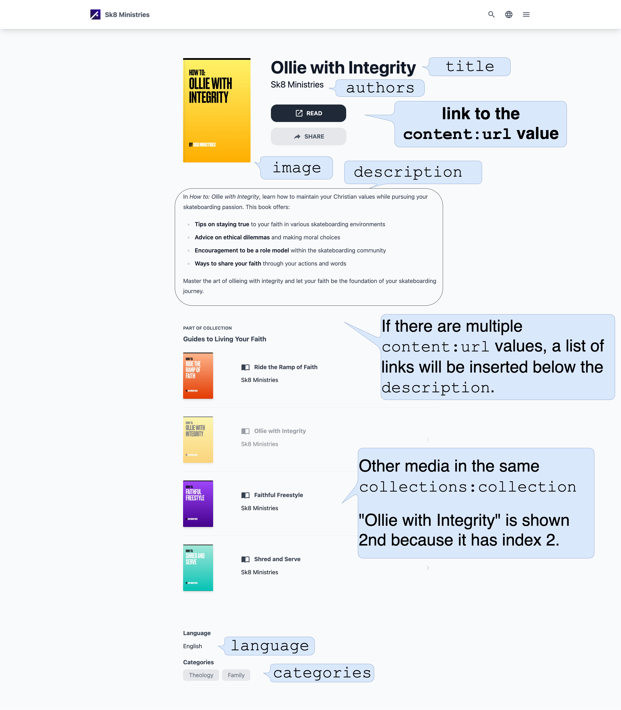

import { Aside } from '@astrojs/starlight/components';

Media items are the core of your media library.
Each media item shows up on the search page and has its own details page.
Use media items to describe your sermons, music, videos, and other media content.
Each file in the `src/content/media` folder describes one media item. Every media item references
at least one content URL, e.g., a MP3 file, a YouTube video, or a PDF file.

Here is an example of a media item:

```json title="src/content/media/sermon-1--en.json"
{
  "commonId": "sermon-1",
  "title": "The Good Samaritan",
  "description": "A sermon about the Good Samaritan",
  "type": "video",
  "image": "./images/sermon-1-en.jpg",
  "categories": ["sermons"],
  "language": "en",
  "content": [
    {
      "url": "https://www.youtube.com/watch?v=1234"
    }
  ]
}
```

<Aside>
  By convention we name our files with the following pattern:
  `commonId--language.json`. This makes it easy to find the media item for a
  specific language.
</Aside>

## Reference

A media item is a JSON file describing a media item.
We recommend to fill as many properties as possible to provide a good user experience.



The image above shows how the available properties' values are rendered on the
media item's detail page.

Here is a description of the available properties.

### commonId

type: `string` \
example: `"sermon-1"` \
required: `true`

The `commonId` is a unique identifier for a media item. If your media item is available in multiple languages,
you should create a media item for each language. In this case use the same `commonId` for all languages.
LightNet uses the `commonId` to find translations of a media item.

### title

type: `string` \
example: `"The Good Samaritan"` \
required: `true`

The title of the media item. The title should be in the language of the media item.

### language

type: `string`\
example: `"en"` \
required: `true`

The content language of the media item. The language must be a BCP-47 language code like `en`, `de`, `fr`.
The language is used to filter media items by language and to display the media item correctly.
For every content language you need to provide a language definition in the `astro.config.mjs` file.

### type

type: `string`\
example: `"video"` \
required: `true`

This property defines the media type of the media item. It references a file inside the `src/content/media-types` folder.
For example if you have a file `src/content/media-types/book.json` you can set the the `type` property to `book`.
The media type is used to determine the layout of the media item details page.

### image

type: `string`\
example: `"./images/sermon-1-en.jpg"` \
required: `true`

The path to the image file that should be used as a cover image for the media item. The image should be in the `src/content/media/images` folder.
By convention we name our image files with the following pattern: `[commonId]--[language]`. If the image contains text, it should be in the language of the media item.
Provided image formats include `jpg`, `png`, `webp`. The image is optimized for performance.
We recommend to use a image that is at least 1000px wide to ensure that it looks good on all devices.

### content

type: `{ url: string, label?: string }[]`\
example: `[{url: "https://www.youtube.com/watch?v=1234"}]` \
required: `true` (at least one content object is required)

This references the actual content of the media item. For example this references a video on YouTube or a file served from your server.
The `content` property is an array of objects. The first object in the array is considered to be the primary content of the media item.
The primary content is used for example with the embedded video player on the media item details page. All other content objects are considered to be additional content.
They are displayed on the content section of the media item details page.

#### content: url

type: `string`\
example: `"/files/sermon-1.mp3"` \
required: `true`

Each object has a `url` property that points to the content.
If you want to make a file available for your media item, store it inside the `public/files` folder and reference it with the `url` property.
For example if you have a pdf file `public/files/sermon-1.pdf` you can reference it with `url: "/files/sermon-1.pdf"`.

<Aside type='tip'>
  For a good user experience make sure to keep your files inside `public/files`
  as small as possible. They won't be further optimized for performance.
</Aside>

These URL types are supported:

| URL type         | Example                                  |
| ---------------- | ---------------------------------------- |
| YouTube video    | `"https://www.youtube.com/watch?v=1234"` |
| Vimeo video      | `"https://vimeo.com/1234"`               |
| Internal file    | `"/files/sermon-1.pdf"`                  |
| External file    | `"https://cdn.example.com/sermon-1.mp3"` |
| External website | `"https://example.com/sermon-1"`         |

<Aside type='tip'>
  Use the [media type](/content/media-types) to configure how the content should
  be displayed. For example if you have a video you can configure the video
  player to be used.
</Aside>

#### content: label

type: `string`\
example: `"Sermon 1"` \
required: `false`

The `label` property is optional and can be used to give a name to the content. This label is displayed on the content section of the media item details page.
If no `label` property is provided the label is derived from the `url` property. For example if the `url` property is `"/files/sermon-1.pdf"` the label is `sermon-1`.
If it is `"https://www.youtube.com/watch?v=1234"` the content label is `youtube.com`. You can also use a translation key for the label.

### dateCreated

type: `string`\
example: `"2022-01-01"` \
required: `true`

The date when the media item was created in this library. The date should be in the format `YYYY-MM-DD`.
This date is used to sort the media items from newest to oldest.

<Aside type='note'>
  The dateCreated is when the media item was added to your LightNet media
  library not when it was originally published.
</Aside>

### description

type: `string` \
example: `"A sermon about the Good Samaritan"` \
required: `false`

A short description of the media item. The description must be in the language of the media item.
Use Markdown syntax for formatting the text. The first 350 characters are included on the search page.

### authors

type: `string[]` \
example: `["John Doe", "Jane Doe"]` \
required: `false`

An array containing the names of the person(s)/organizations(s) that created the media item.

### categories

type: `string[]`\
example: `["sermons"]` \
required: `false`

An array containing the identifiers of the categories this media item belongs to. The category ids should match files
in the `src/content/categories` folder. For example if you have a file `src/content/categories/sermons.json` you can set the the `categories` property to `["sermons"]`.

### collections

type: `{ collection: string, index?: number }[]`\
example: `[{collection: "sermon-series", index: 1}]` \
required: `false`

An array containing references to collections this media item is contained in.
These are the properties of each collection reference object:

#### collections: collection

type: `string`\
example: `"sermon-series"` \
required: `true`

Identifier of the collections this media item belongs to. It must match a collection definition inside
the `src/content/media-collections` folder. For example if you have a file `src/content/media-collections/sermon-series.json` you can set the the `collections` property to `"sermon-series"`.

#### collections: index

type: `number`\
example: `1` \
required: `false`

The index of the media item in the collection. The index is used to sort the media items in the collection.
Entries with a lower index are sorted first. Entries without index are sorted after the entries with an index.
Entries with the same index are sorted by their identifier.
